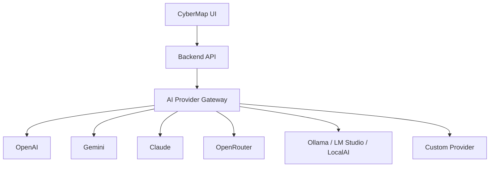
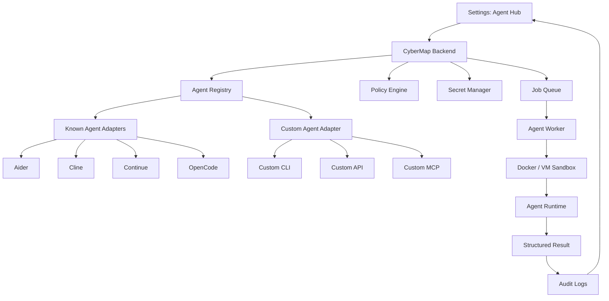
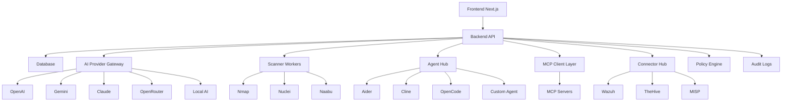

# CyberMap — Archivo Maestro del Proyecto

**Estado:** Diseño inicial consolidado  
**Versión:** 0.1  
**Rol del documento:** Fuente única de verdad para iniciar el desarrollo paso a paso  
**Enfoque:** Plataforma web de ciberseguridad asistida por IA, agentes, MCP y conectores  

---

## 1. Objetivo del proyecto

CyberMap será una plataforma web de ciberseguridad que toma como referencia funcional el repositorio comunitario **Visual-Map**, pero será rediseñada como un producto propio, modular, extensible y más potente.

El objetivo principal es permitir:

1. Cargar y analizar datos obtenidos por escaneos.
2. Visualizar activos, servicios, vulnerabilidades y relaciones de red.
3. Dividir la plataforma en áreas de trabajo:
   - Exploration
   - Blue Team
   - Red Team
4. Integrar múltiples proveedores de IA.
5. Integrar agentes locales, open-source, comerciales o personalizados.
6. Integrar MCP y conectores de ciberseguridad.
7. Generar reportes técnicos y ejecutivos.
8. Mantener una arquitectura segura, auditable y extensible.

---

## 2. Principios de diseño

1. **Modularidad:** cada capacidad debe vivir en módulos separados.
2. **Seguridad por diseño:** nada de claves en frontend, ejecución aislada y auditoría.
3. **Extensibilidad:** proveedores IA, agentes, MCP y conectores deben poder ampliarse.
4. **Control humano:** ninguna acción sensible debe ejecutarse sin aprobación.
5. **Trazabilidad:** cada hallazgo debe tener evidencia y origen.
6. **Compatibilidad local/self-hosted:** debe funcionar en entornos propios.
7. **UX clara:** la interfaz debe separar configuración, análisis y ejecución.
8. **Internacionalización:** soporte mínimo para español e inglés.
9. **Tematización:** dashboard con temas visuales configurables.
10. **Evolución paso a paso:** no avanzar de fase hasta validar evidencias.

---

## 3. Nombre definido

**Nombre del proyecto:** CyberMap

CyberMap representa una plataforma visual y operativa para mapear activos, exposición, riesgos, rutas de ataque, remediaciones, automatizaciones y reportes de ciberseguridad.

---

## 4. Inspiración inicial

CyberMap toma como referencia funcional Visual-Map, una plataforma orientada a cargar datos de Nmap, visualizar hosts, puertos, servicios, CVE y usar IA para análisis y reportes.

La nueva plataforma no debe ser solo un fork superficial. Debe rediseñarse como una arquitectura más profesional:

- Multi-IA.
- Multi-agente.
- Configuración avanzada desde UI.
- Separación Exploration / Blue Team / Red Team.
- Conectores y MCP.
- Workers aislados.
- Gestión segura de secretos.
- Auditoría.

---

## 5. Alcance funcional inicial

### 5.1 Exploration

Área dedicada a reconocimiento, importación y análisis inicial de superficie.

Funciones previstas:

1. Importar XML de Nmap.
2. Importar JSON de Nuclei.
3. Importar resultados de Amass/Subfinder en fases posteriores.
4. Visualizar activos descubiertos.
5. Visualizar puertos y servicios.
6. Grafo de red.
7. Historial de escaneos.
8. Timeline de actividad.
9. Gestión de evidencia técnica.
10. Ejecución de escaneos controlados en fases posteriores.

### 5.2 Blue Team

Área defensiva para priorización, remediación, hardening y reportes.

Funciones previstas:

1. Priorización de vulnerabilidades.
2. Análisis CVE.
3. Mapeo MITRE ATT&CK.
4. Recomendaciones de remediación.
5. Hardening por activo/servicio.
6. Reportes ejecutivos.
7. Reportes técnicos.
8. Integración futura con Wazuh, TheHive, MISP, OpenCTI u otros.
9. Playbooks defensivos.
10. Gestión de tareas de remediación.

### 5.3 Red Team

Área ofensiva controlada y orientada a validación autorizada.

Funciones previstas:

1. Rutas de ataque teóricas.
2. Validación manual guiada.
3. Checklists de pentesting.
4. Evidencia por hallazgo.
5. Simulación de caminos de compromiso.
6. Integración futura con herramientas bajo sandbox.
7. Nunca ejecutar acciones ofensivas fuera de alcance autorizado.

---

## 6. Estructura general de navegación

```text
CyberMap
├── Dashboard
├── Exploration
│   ├── Upload Scans
│   ├── Run Scans
│   ├── Assets
│   ├── Hosts
│   ├── Services
│   ├── Ports
│   ├── Vulnerabilities
│   ├── Network Graph
│   └── Evidence
├── Blue Team
│   ├── Risk Prioritization
│   ├── Remediation
│   ├── Hardening
│   ├── MITRE ATT&CK Mapping
│   ├── Defensive Playbooks
│   └── Reports
├── Red Team
│   ├── Attack Paths
│   ├── Validation Checklist
│   ├── Findings
│   ├── Evidence
│   └── Controlled Actions
├── Automation
│   ├── Agents
│   ├── Tasks
│   ├── Playbooks
│   └── Logs
└── Settings
    ├── Appearance
    ├── AI Providers
    ├── Agents
    ├── MCP
    ├── Connectors
    ├── Languages
    ├── Users and Roles
    ├── Security
    └── Audit
```

---

## 7. Interfaz gráfica definida

### 7.1 Variantes principales

Se definieron tres líneas visuales principales:

1. **Dark Pro**
   - Técnica.
   - Profesional.
   - Fondo oscuro sobrio.
   - Ideal para uso diario.

2. **Light Modern**
   - Limpia.
   - Corporativa.
   - Adecuada para reportes y entornos ejecutivos.

3. **Neon Cyber**
   - Futurista.
   - Visual.
   - Más llamativa para demos y presentaciones.

### 7.2 Variantes de color agregadas

Se agregaron variantes adicionales:

1. **Claude Warm**
   - Tonos beige, arena y terracota.
   - Estética cálida, editorial y elegante.

2. **Dracula Tech**
   - Oscuro.
   - Magenta, cian y violeta.
   - Inspirado en estilo Dracula.

3. **Hacking Green**
   - Fondo negro profundo.
   - Verde luminoso.
   - Estética hacker moderna, pero legible.

### 7.3 Fondos configurables

El dashboard debe permitir seleccionar fondo visual:

1. Nodos.
2. Cuadrícula.
3. Puntos.
4. Ninguno.
5. Posible fondo animado en fase posterior.

### 7.4 Configuración visual desde UI

Pantalla: **Settings → Appearance**

Campos:

- Tema del dashboard.
- Variante de color.
- Fondo.
- Densidad visual.
- Reducción de animaciones.
- Idioma.
- Modo compacto.

---

## 8. Idiomas

CyberMap debe soportar al menos:

1. Español.
2. Inglés.

Recomendación técnica:

- Usar `next-intl` o equivalente.
- Estructura de traducciones por namespace.
- No hardcodear textos en componentes.

Ejemplo:

```text
/locales
├── es
│   ├── common.json
│   ├── dashboard.json
│   ├── settings.json
│   └── reports.json
└── en
    ├── common.json
    ├── dashboard.json
    ├── settings.json
    └── reports.json
```

---

## 9. Proveedores de IA

### 9.1 Objetivo

CyberMap no debe estar limitado a Gemini. Debe permitir múltiples proveedores y modelos, incluyendo proveedores locales y personalizados.

### 9.2 Proveedores comunes

1. OpenAI / ChatGPT.
2. Gemini.
3. Claude.
4. OpenRouter.
5. Ollama.
6. LM Studio.
7. LocalAI.
8. Otro / Personalizado.

### 9.3 Configuración desde UI

Pantalla: **Settings → AI Providers**

Campos:

- Proveedor.
- Modelo.
- API Key.
- Base URL.
- Tipo de pensamiento / razonamiento.
- Temperatura.
- Máximo de tokens.
- Modo privacidad.
- Probar conexión.
- Establecer como predeterminado.

### 9.4 Tipo de pensamiento / razonamiento

Opciones iniciales:

1. Rápido.
2. Balanceado.
3. Profundo.
4. Estructurado.
5. Sin razonamiento extendido.

### 9.5 Seguridad de claves

Reglas:

1. Nunca guardar API keys en frontend.
2. Nunca usar variables `NEXT_PUBLIC_*` para secretos.
3. Guardar secretos cifrados o como referencias.
4. Mostrar solo estado: configurado/no configurado.
5. Permitir rotación de claves.
6. Registrar uso por proveedor.

### 9.6 Modelo conceptual

```ts
export type AiProviderType =
  | "openai"
  | "gemini"
  | "anthropic"
  | "openrouter"
  | "ollama"
  | "lmstudio"
  | "localai"
  | "custom";

export type ThinkingMode =
  | "fast"
  | "balanced"
  | "deep"
  | "structured"
  | "no_reasoning";

export interface AiProviderConfig {
  id: string;
  name: string;
  providerType: AiProviderType;
  baseUrl?: string;
  apiKeySecretRef?: string;
  model: string;
  thinkingMode: ThinkingMode;
  temperature: number;
  maxTokens: number;
  enabled: boolean;
  isDefault: boolean;
}
```

---

## 10. AI Provider Gateway

### 10.1 Objetivo

Crear una capa intermedia para que CyberMap use cualquier proveedor de IA sin acoplar la lógica del producto a una marca específica.

### 10.2 Arquitectura



### 10.3 Contrato técnico

```ts
export interface AiMessage {
  role: "system" | "user" | "assistant" | "tool";
  content: string;
}

export interface AiClient {
  generate(messages: AiMessage[], config: AiProviderConfig): Promise<string>;
}

export interface AiProviderAdapter {
  id: string;
  displayName: string;
  validateConfig(config: AiProviderConfig): Promise<void>;
  testConnection(config: AiProviderConfig): Promise<ConnectionTestResult>;
  generateText(input: AiGenerateInput): Promise<AiGenerateResult>;
}
```

---

## 11. Agentes

### 11.1 Objetivo

CyberMap debe permitir integrar agentes conocidos y personalizados para asistir tareas de análisis, desarrollo, documentación, automatización y revisión.

### 11.2 Agentes iniciales previstos

1. Codex CLI.
2. Claude Code.
3. Gemini CLI.
4. Aider.
5. Cline.
6. Continue.
7. OpenCode.
8. Goose.
9. CrewAI.
10. AutoGen.
11. LangGraph.
12. Otro / Personalizado.

### 11.3 Clasificación por tipo

| Tipo | Ejemplos | Integración |
|---|---|---|
| CLI local | Aider, OpenCode, Codex CLI | Worker aislado |
| IDE agent | Cline, Continue | IDE bridge / export task |
| API agent | Servicios remotos | REST / Webhook |
| Framework agent | CrewAI, AutoGen, LangGraph | Worker Python/Node |
| MCP agent/tool | Servidores MCP | MCP Client |
| Custom | Cualquier agente | CLI / API / MCP |

### 11.4 Agent Hub

CyberMap debe incluir un módulo central llamado **Agent Hub**.

Funciones:

1. Catálogo de agentes.
2. Detección de instalación.
3. Configuración de proveedor IA por agente.
4. Permisos por agente.
5. Modo sandbox.
6. Aprobación humana.
7. Dry-run.
8. Ejecución controlada.
9. Logs.
10. Historial.

### 11.5 Arquitectura de agentes



### 11.6 Modelo conceptual

```ts
export type AgentKind =
  | "codex"
  | "claude_code"
  | "gemini_cli"
  | "aider"
  | "cline"
  | "continue"
  | "opencode"
  | "goose"
  | "crewai"
  | "autogen"
  | "langgraph"
  | "custom";

export type AgentIntegrationType =
  | "cli"
  | "api"
  | "mcp"
  | "ide_bridge"
  | "framework";

export type AgentPermission =
  | "read_workspace"
  | "write_workspace"
  | "run_commands"
  | "run_scanners"
  | "network_access"
  | "read_scan_data"
  | "write_findings"
  | "create_reports"
  | "manage_connectors"
  | "use_mcp_tools";

export interface AgentConfig {
  id: string;
  name: string;
  kind: AgentKind;
  integrationType: AgentIntegrationType;
  modelProviderId?: string;
  model?: string;
  cli?: {
    command: string;
    argsTemplate: string[];
    workingDirectory: string;
  };
  api?: {
    baseUrl: string;
    authType: "none" | "api_key" | "bearer" | "basic";
    secretRef?: string;
    taskEndpoint?: string;
    statusEndpoint?: string;
  };
  mcp?: {
    transport: "stdio" | "http";
    command?: string;
    args?: string[];
    url?: string;
    allowedTools: string[];
  };
  permissions: AgentPermission[];
  requiresHumanApproval: boolean;
  sandboxEnabled: boolean;
  timeoutSeconds: number;
  enabled: boolean;
}
```

### 11.7 Permisos por agente

| Permiso | Descripción | Valor recomendado |
|---|---|---|
| read_workspace | Leer archivos del workspace | Activado |
| write_workspace | Modificar archivos | Requiere aprobación |
| run_commands | Ejecutar comandos | Desactivado por defecto |
| run_scanners | Ejecutar herramientas de escaneo | Requiere aprobación |
| network_access | Acceso a red | Desactivado por defecto |
| read_scan_data | Leer resultados importados | Activado |
| write_findings | Crear hallazgos | Activado |
| create_reports | Generar reportes | Activado |
| manage_connectors | Usar conectores externos | Desactivado por defecto |
| use_mcp_tools | Usar herramientas MCP | Allowlist obligatoria |

---

## 12. MCP

### 12.1 Objetivo

MCP debe usarse como una capa estándar para conectar modelos, agentes y herramientas externas.

### 12.2 Pantalla de configuración

Pantalla: **Settings → MCP**

Campos:

- Nombre del servidor MCP.
- Transporte: stdio o HTTP.
- Comando o URL.
- Argumentos.
- Herramientas habilitadas.
- Permisos.
- Requiere aprobación.
- Test de conexión.
- Logs.

### 12.3 Reglas

1. Ninguna herramienta MCP debe ejecutarse sin declaración de capabilities.
2. Las herramientas sensibles requieren approval.
3. Debe haber allowlist por servidor MCP.
4. Deben registrarse inputs y outputs relevantes.
5. Debe bloquearse acceso a secretos si no es necesario.

---

## 13. Conectores

### 13.1 Objetivo

Permitir conectar CyberMap con herramientas de ciberseguridad y sistemas externos.

### 13.2 Conectores candidatos

| Categoría | Herramientas |
|---|---|
| Escaneo | Nmap, Nuclei, Naabu, Masscan |
| OSINT | Amass, Subfinder, Shodan, Censys |
| Vulnerabilidades | NVD, CVE.org, Vulners, EPSS |
| Blue Team | Wazuh, TheHive, MISP, OpenCTI |
| Gestión | Jira, GitHub Issues, GitLab Issues |
| Repositorios | GitHub, GitLab |
| Infraestructura | Docker, Kubernetes |
| Custom | Otro / Personalizado |

### 13.3 Opción Otro / Personalizado

Campos:

- Nombre.
- Tipo.
- Base URL.
- Auth Type.
- Secret Ref.
- Capabilities.
- Test Connection.
- Sync Schedule.
- Permisos.

---

## 14. Seguridad

### 14.1 Riesgos principales

| Riesgo | Severidad | Mitigación |
|---|---|---|
| Exposición de API keys | Alta | Secret manager, nunca frontend |
| Ejecución arbitraria | Crítica | Sandbox, allowlist, approval |
| Escaneo fuera de alcance | Crítica | Scope obligatorio |
| Prompt injection | Alta | Separar datos/instrucciones/tools |
| Fuga de datos a IA externa | Alta | Modo local, redacción, clasificación |
| Costos inesperados | Media | Límites por usuario/proveedor |
| Resultados falsos | Media | Evidencia trazable |

### 14.2 Controles mínimos

1. RBAC: Role-Based Access Control.
2. Scope autorizado.
3. Aprobación humana.
4. Sandbox Docker/VM.
5. Logs de auditoría.
6. Redacción de secretos.
7. Timeouts.
8. Rate limiting.
9. Allowlist/denylist de comandos.
10. Gestión segura de secretos.

---

## 15. Arquitectura técnica propuesta



---

## 16. Estructura de repositorio recomendada

```text
cybermap/
├── apps/
│   ├── web/
│   │   ├── app/
│   │   ├── components/
│   │   ├── features/
│   │   ├── hooks/
│   │   ├── lib/
│   │   └── styles/
│   └── api/
│       ├── src/
│       │   ├── modules/
│       │   ├── routes/
│       │   ├── services/
│       │   ├── repositories/
│       │   ├── middlewares/
│       │   └── config/
├── packages/
│   ├── core/
│   ├── ai-gateway/
│   ├── agent-hub/
│   ├── parsers/
│   ├── connectors/
│   ├── mcp-client/
│   ├── reports/
│   └── ui/
├── workers/
│   ├── scanner-worker/
│   └── agent-worker/
├── infra/
│   ├── docker/
│   ├── compose.yml
│   └── scripts/
├── docs/
│   ├── architecture.md
│   ├── threat-model.md
│   ├── roadmap.md
│   ├── frontend-spec.md
│   ├── agent-hub.md
│   └── ai-gateway.md
├── tests/
├── .env.example
├── package.json
├── README.md
└── SECURITY.md
```

---

## 17. Stack técnico inicial recomendado

### 17.1 Frontend

- Next.js.
- TypeScript.
- Tailwind CSS.
- shadcn/ui o componentes propios.
- React Flow para grafos.
- Recharts o Tremor para métricas.
- Zustand o TanStack Query para estado/datos.
- next-intl para idiomas.

### 17.2 Backend

Opciones viables:

1. FastAPI con Python.
2. NestJS con TypeScript.
3. Next.js API routes solo para MVP limitado.

Recomendación inicial:

- **Frontend:** Next.js.
- **Backend API:** FastAPI o NestJS.
- **Workers:** Python para escaneo/agentes puede ser más flexible.

### 17.3 Base de datos

- PostgreSQL como base principal.
- SQLite solo para MVP local rápido.
- Redis para colas/cache en fases posteriores.

### 17.4 Workers

- Docker como sandbox inicial.
- Job queue: BullMQ, Celery o equivalente.
- Logs persistentes.

---

## 18. Modelo de datos inicial

Entidades principales:

1. User.
2. Role.
3. Project.
4. Asset.
5. Host.
6. Port.
7. Service.
8. Vulnerability.
9. Finding.
10. Evidence.
11. Scan.
12. Report.
13. AiProviderConfig.
14. AgentConfig.
15. McpServerConfig.
16. ConnectorConfig.
17. AuditEvent.
18. Task.
19. Scope.

---

## 19. Roadmap por fases

### Fase 0 — Preparación

1. Crear repositorio local.
2. Crear README inicial.
3. Crear estructura base.
4. Crear `.gitignore`.
5. Crear `.env.example`.
6. Inicializar Git.
7. Primer commit.

### Fase 1 — Frontend visual

1. Crear layout principal.
2. Sidebar.
3. Dashboard base.
4. Temas visuales.
5. Fondos configurables.
6. Idiomas español/inglés.
7. Pantallas Settings.
8. Componentes mock sin backend.

### Fase 2 — Parsers y datos locales

1. Parser Nmap XML.
2. Parser Nuclei JSON.
3. Normalización de activos.
4. Dashboard con datos mock/reales.
5. Grafo de red.

### Fase 3 — AI Gateway

1. Configuración IA desde UI.
2. OpenAI-compatible provider.
3. OpenRouter.
4. Ollama/local.
5. Gemini/Claude.
6. Test de conexión.
7. Prompts por caso de uso.

### Fase 4 — Reportes

1. Reporte técnico.
2. Reporte ejecutivo.
3. Export JSON.
4. Export HTML.
5. Export PDF.

### Fase 5 — Agent Hub

1. Catálogo de agentes.
2. Aider adapter.
3. OpenCode adapter.
4. Custom CLI.
5. Dry-run.
6. Logs.
7. Sandbox.

### Fase 6 — MCP y conectores

1. MCP client básico.
2. Conector NVD/CVE.
3. Conector Wazuh experimental.
4. Conector TheHive/MISP experimental.
5. Custom connector.

### Fase 7 — Hardening

1. RBAC.
2. Auditoría.
3. Gestión de secretos.
4. Policy Engine.
5. Tests.
6. Documentación completa.

---

## 20. Flujo de trabajo acordado

El desarrollo se hará paso a paso.

Regla operativa:

1. Se propone un paso.
2. El usuario lo ejecuta en su máquina.
3. El usuario pasa evidencia:
   - captura,
   - salida de terminal,
   - árbol de archivos,
   - logs,
   - errores.
4. Se valida la evidencia.
5. Recién ahí se pasa al siguiente paso.

No se avanzará con capas superiores si la base anterior no está validada.

---

## 21. Evidencias esperadas por fase

### Fase 0

Evidencias:

- `pwd`.
- `node -v`.
- `npm -v`.
- `git --version`.
- `tree -a -L 3` o equivalente.
- `git status`.

### Fase 1

Evidencias:

- Captura del dashboard.
- Captura de Settings.
- `npm run dev` funcionando.
- `npm run build` sin errores.

### Fase 2

Evidencias:

- Archivo Nmap XML de prueba.
- Resultado parseado.
- Hosts visibles en UI.
- Grafo renderizado.

### Fase 3

Evidencias:

- Provider IA configurado.
- Test de conexión.
- Respuesta de análisis simple.
- Sin API key visible en frontend.

### Fase 5

Evidencias:

- Agente detectado.
- Dry-run.
- Log de ejecución.
- Sandbox activo.

---

## 22. Primera decisión técnica pendiente

Antes de generar archivos reales del proyecto, se debe decidir:

1. Backend en FastAPI o NestJS.
2. Monorepo con pnpm, npm workspaces o estructura simple.
3. Uso inicial de SQLite o PostgreSQL.
4. UI library: shadcn/ui, Radix + Tailwind o componentes propios.

Recomendación inicial para empezar simple:

- Next.js + TypeScript.
- Tailwind CSS.
- shadcn/ui.
- SQLite o datos mock en Fase 1.
- Backend separado recién en Fase 2/3 si se prefiere avanzar visualmente primero.

---

## 23. Decisión recomendada de inicio

Como el usuario todavía está en cero y no creó el repositorio local, la mejor secuencia es:

1. Crear carpeta local `cybermap`.
2. Inicializar Git.
3. Crear proyecto Next.js.
4. Configurar Tailwind.
5. Crear layout base.
6. Crear dashboard visual mock.
7. Crear Settings con pestañas:
   - Appearance.
   - AI Providers.
   - Agents.
   - MCP.
   - Connectors.
   - Languages.
   - Security.
   - Audit.
8. Validar visualmente.
9. Luego profundizar backend.

---

## 24. Checklist de seguridad inicial

- [ ] No incluir secretos reales en Git.
- [ ] Crear `.env.example`, no `.env` real.
- [ ] Agregar `.env` a `.gitignore`.
- [ ] No usar variables públicas para API keys.
- [ ] Crear `SECURITY.md`.
- [ ] Documentar uso autorizado.
- [ ] Diseñar threat model antes de agentes.
- [ ] Agregar logs antes de ejecución automatizada.
- [ ] Agregar approval antes de comandos activos.

---

## 25. Próximo paso recomendado

Iniciar Fase 0:

1. Verificar entorno local.
2. Crear carpeta del proyecto.
3. Inicializar Git.
4. Crear proyecto Next.js.
5. Pasar evidencias para control.

Comandos sugeridos se definirán en el próximo paso, según sistema operativo y gestor de paquetes disponible.

---

## 26. Nota final

Este documento debe actualizarse a medida que el proyecto avance. Su función es mantener alineadas las decisiones de producto, arquitectura, seguridad, frontend, backend, agentes, IA, MCP y conectores.

