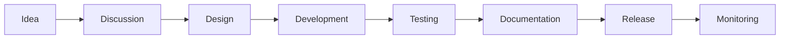

# CyberMap Features

Documentación de capacidades actuales, planificadas y futuras.

---

## 📊 Estado General

| Área | Status | Version | Docs |
|------|--------|---------|------|
| **Settings** | ✅ Completo | 0.1.0 | [API Contract](api/settings-contract.md) |
| **Exploration** | ✅ MVP | 0.1.0 | [API Contract](api/exploration-contract.md) |
| **AI Analysis** | 🔄 Mock | 0.1.0 | [Architecture](architecture.md) |
| **Blue Team** | 🔴 Pendiente | 0.2.0 | [Roadmap](roadmap.md) |
| **Red Team** | 🔴 Pendiente | 0.3.0 | [Roadmap](roadmap.md) |
| **MCP Integration** | 🔴 Pendiente | 0.4.0 | [Roadmap](roadmap.md) |
| **AI Providers Real** | 🔴 Pendiente | 1.0.0 | [Roadmap](roadmap.md) |

---

## ✅ Features Actuales (v0.1.0)

### Settings Management

**Descripción:** Panel de configuración centralizado para personalizar CyberMap.

**Capacidades:**
- Crear, leer, actualizar configuraciones
- Persistencia en JSON local (MVP) / SQLite (próximo)
- Sync automático frontend ↔ backend
- Validación de payload
- UI indicador de sincronización
- Importar/exportar configuración

**UI:** [/settings](http://localhost:3000/settings)

**API Endpoints:**
```
GET  /settings              # Obtener configuración actual
PUT  /settings              # Actualizar configuración
POST /settings/import       # Importar desde archivo
GET  /settings/export       # Exportar configuración
```

**Limitaciones actuales:**
- Sin multi-user
- Sin versionado de cambios
- Sin auditoría (próximo)

---

### Exploration: Asset Management

**Descripción:** Importar, registrar y explorar activos de red y servicios.

**Capacidades:**

#### 1. Asset Tracking
- Crear activos manualmente (API)
- Listar todos los activos
- Ver detalles del activo
- Filtrar por tipo (host, servicio, etc)

**API:**
```
GET  /exploration/assets           # Listar activos
POST /exploration/assets           # Crear activo
GET  /exploration/assets/{id}      # Obtener detalles
```

#### 2. Findings Management
- Registrar hallazgos (vulnerabilidades, issues)
- Listar hallazgos
- Filtrar por severidad, estado
- Vincular hallazgos a activos

**API:**
```
GET  /exploration/findings         # Listar hallazgos
POST /exploration/findings         # Crear hallazgo
GET  /exploration/findings/{id}    # Obtener detalles
```

#### 3. Service Detection
- Detectar servicios en hosts
- Registrar puertos abiertos
- Versiones de servicios
- Historial de cambios

**API:**
```
GET  /exploration/services         # Listar servicios
POST /exploration/services         # Crear servicio
```

#### 4. Nmap Import (Signature Feature)
- **Importar escaneos Nmap en formato XML**
- Parsear hosts, puertos, servicios automáticamente
- Validar XML
- Deduplicación inteligente
- Prevenir duplicados
- Ver resumen de importación
- Advertencias de conflictos

**UI:** [/exploration](http://localhost:3000/exploration) → "Import Nmap XML"

**API:**
```
POST /exploration/imports/nmap
  Content-Type: application/json
  {
    "xml_content": "<nmaprun>...</nmaprun>",
    "merge_strategy": "merge|replace|skip_duplicates"
  }
```

**Ejemplo XML de prueba:**
```bash
curl -X POST http://localhost:8000/exploration/imports/nmap \
  -H "Content-Type: application/json" \
  -d '{
    "xml_content": "<nmaprun>...</nmaprun>",
    "merge_strategy": "merge"
  }'
```

**Validaciones:**
- XML debe ser válido
- Debe contener al menos 1 host
- Hosts duplicados detectados automáticamente

---

### AI Analysis (Mock)

**Descripción:** Integración con AI para análisis asistido de superficie, priorización y reportes.

**Capacidades (v0.1.0 - Mock):**
- Simular análisis IA
- Registrar "runs" (ejecuciones)
- Almacenar resultados de análisis
- Historial de análisis

**UI:** [/exploration](http://localhost:3000/exploration) → "AI Analysis"

**API:**
```
POST /ai/runs
  {
    "target_type": "assets|services|findings",
    "target_ids": ["id1", "id2"],
    "analysis_type": "risk_assessment|remediation|threat_modeling",
    "provider": "openai|claude|gemini|mock"
  }

GET  /ai/runs             # Listar todas las ejecuciones
GET  /ai/runs/{id}        # Obtener resultado
```

**Capacidades Futuras:**
- OpenAI GPT-4 real
- Anthropic Claude real
- Google Gemini real
- Ollama (local open-source)
- LM Studio (local)
- LocalAI (local)

**Limitaciones actuales:**
- Mock responses (no AI real)
- Sin streaming
- Sin token counting
- Sin cost tracking
- Sin rate limiting

---

## 🔜 Features Próximas (Roadmap)

### Fase 1: AI Real (v0.2.0 - 2-3 sprints)
- [ ] OpenAI provider
- [ ] Claude provider (Anthropic)
- [ ] Gemini provider (Google)
- [ ] Provider gateway
- [ ] Token counting
- [ ] Cost tracking
- [ ] Rate limiting

### Fase 2: Agent Hub (v0.3.0 - 4-6 sprints)
- [ ] Aider agent
- [ ] OpenCode agent
- [ ] Cline agent
- [ ] Custom CLI agents
- [ ] Custom API agents
- [ ] Sandbox execution

### Fase 3: Blue Team Features (v0.4.0 - 6-8 sprints)
- [ ] CVE database integration
- [ ] CVSS scoring
- [ ] Vulnerability prioritization
- [ ] Remediation recommendations
- [ ] Hardening guides
- [ ] MITRE ATT&CK mapping
- [ ] Defensive playbooks
- [ ] Technical reports
- [ ] Executive reports

### Fase 4: Red Team Features (v0.5.0 - 8-10 sprints)
- [ ] Attack path analysis
- [ ] Validation checklist
- [ ] Controlled pentest simulation
- [ ] Evidence collection
- [ ] Compromise chain modeling

### Fase 5: MCP & Conectores (v1.0.0)
- [ ] MCP server integration
- [ ] MCP tool registry
- [ ] External connector hub
- [ ] Integration marketplace

### Fase 6: Production Ready
- [ ] Multi-user authentication
- [ ] Role-based access control (RBAC)
- [ ] PostgreSQL support
- [ ] Kubernetes deployment
- [ ] Audit logging
- [ ] Backup & recovery

---

## 📈 Matriz de Compatibilidad

### Frontend - Backend

| Endpoint | Frontend | Backend | Status |
|----------|----------|---------|--------|
| Settings | ✅ | ✅ | ✅ Completo |
| Exploration Assets | ✅ | ✅ | ✅ Completo |
| Exploration Findings | ✅ | ✅ | ✅ Completo |
| Exploration Services | ✅ | ✅ | ✅ Completo |
| Nmap Import | ✅ | ✅ | ✅ Completo |
| AI Analysis | ✅ Mock | ✅ Mock | ✅ Mock |

---

## 🔄 Ciclo de Vida de Features



### Para sugerir una feature:
1. Abre una [Discussion](https://github.com/CrisRS89/cybermap/discussions)
2. Describe el problema y la solución propuesta
3. Comunidad discute y valida
4. Si es aceptado, se crea Issue
5. Se agrega al roadmap o sprint actual

---

## 📚 Documentación de Referencia

- [API Contracts](api/)
- [Architecture](architecture/)
- [Development Guide](DEVELOPMENT.md)
- [Roadmap](roadmap.md)
- [Contributing](../CONTRIBUTING.md)

---

**¿Preguntas sobre features?**  
Abre una [Discussion](https://github.com/CrisRS89/cybermap/discussions).
