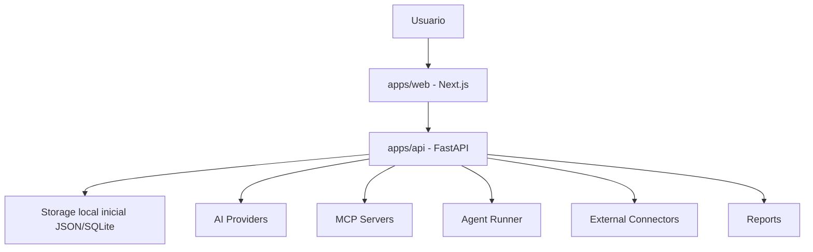

## Objetivo final del proyecto

CyberMap debe convertirse en una plataforma web modular de ciberseguridad asistida por IA, instalable desde GitHub en cualquier ordenador, inicialmente en modo local.

El objetivo no es solo tener una UI bonita, sino una plataforma funcional con:

1. Frontend web en Next.js.
2. Backend API en FastAPI.
3. Persistencia local inicial.
4. Configuración real de módulos.
5. Integración progresiva con:
   - proveedores de IA
   - agentes
   - servidores MCP
   - conectores externos
   - ingesta de assets/findings
   - reportes

## Objetivo MVP

El MVP debe permitir:

1. Clonar el repo desde GitHub.
2. Instalar dependencias.
3. Levantar backend y frontend localmente.
4. Abrir la UI en el navegador.
5. Configurar settings.
6. Persistir settings en backend.
7. Ver estado de sincronización frontend-backend.
8. Ejecutar al menos una prueba funcional por módulo:
   - Health API
   - Settings sync
   - AI mock o provider real controlado
   - Connector mock o ingest local
   - MCP mock/local tool listing
   - Agent mock/sandbox job

## Principio de desarrollo

No avanzar a agentes, MCP, IA o conectores reales hasta que la base esté estable:

- contrato API claro
- settings sync observable
- tests frontend/backend
- README de instalación
- variables de entorno documentadas
- sin secretos en frontend
- ejecución segura por defecto

## Arquitectura objetivo



##Meta final de entrega

El repo debe quedar presentable como proyecto profesional en GitHub, con:

README raíz claro
README por app
instrucciones de instalación
.env.example
tests documentados
comandos de desarrollo
arquitectura explicada
roadmap
límites de seguridad
primera demo funcional end-to-end


# Resumen ejecutivo para el otro chat

También podés agregar esta frase breve:

```md
La prioridad actual no es agregar más UI, sino consolidar CyberMap como producto instalable y funcional: frontend + backend + persistencia + contrato API + estado de sincronización. Luego se avanza progresivamente a IA, conectores, MCP y agentes.
